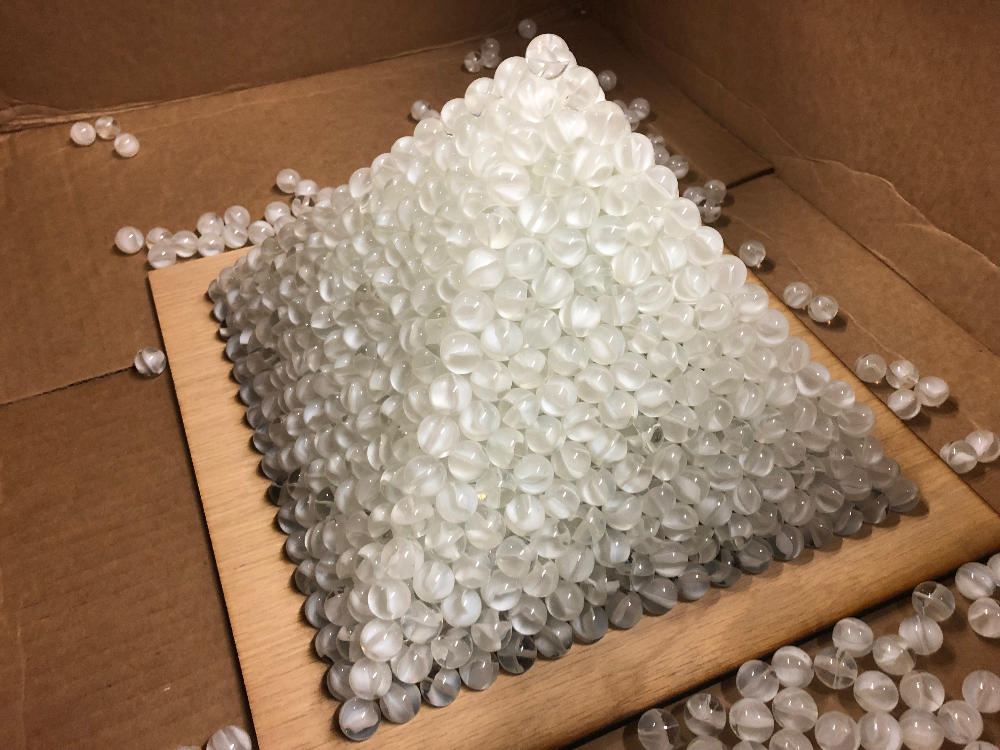
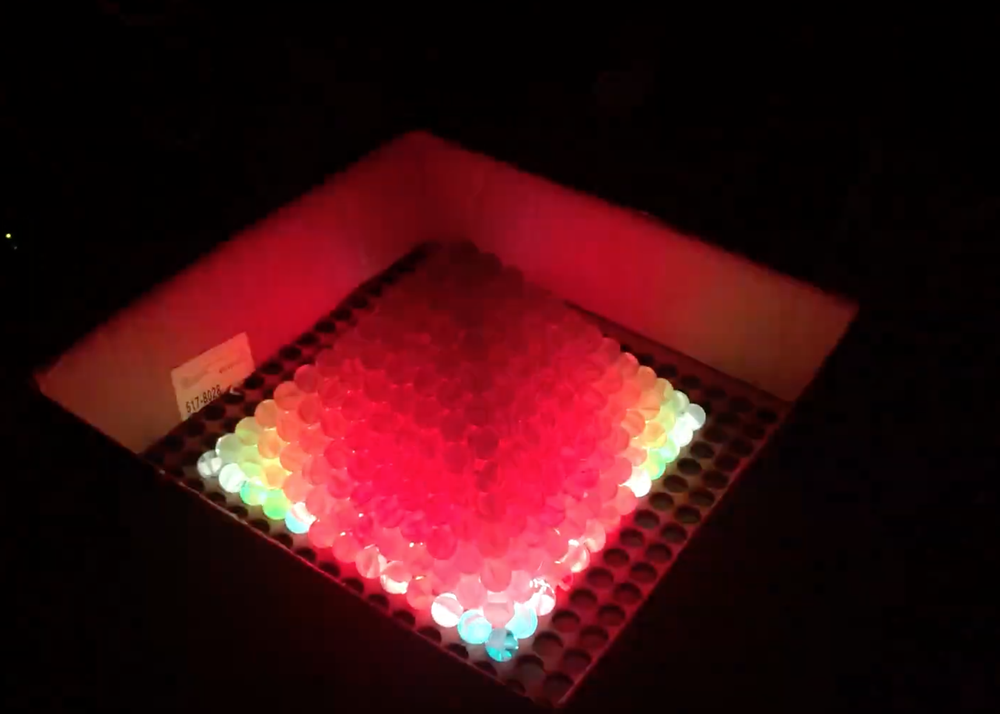

# Pyramid-Of-Destiny

This repository is an attempt to bring together multiple code experiments to light a 32x32 RGB matrix with an Arduino Mega that has as custom soldered shield to connect the Arduino to the matrix and also includes a potentiometer to allow for adjustments to the LEDs as well as an audio sound sensor from Sparkfun. I plan to add a push button so that these separate arduino sketches can be merged into one with various modes trigger via a button.

<a href="https://youtu.be/FYTDi2TmmCg" target ="blank" >Demo Video of P.O.D.</a>

### Plain Pyramid: Phase One

### LED lit Pyramid: Phase Two

### Testing
This is our cool merge test!!!  
